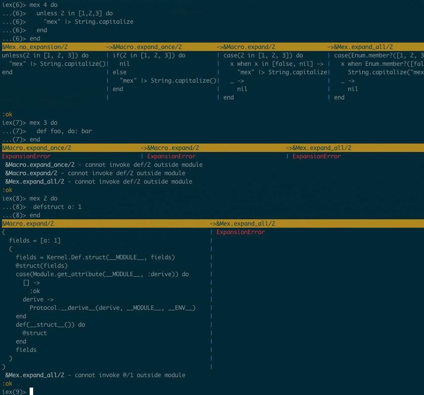

# Mex

An Elixir Shell [helper for previewing macroexpansion](http://blog.maketogether.com/building-a-macro-expansion-helper).

Displays different levels of macroexpansion side-by-side,
along with where and why the expansion fails (if it does).



## Installation

Install by adding a **dev** dependency on `mex`:

  1. Add mex to your list of dependencies in `mix.exs`:

        def deps do
          [{:mex, "~> 0.0.1", only: :dev}]
        end

  2. Ensure mex is started before your application:

        def application do
          [applications: [:mex]]
        end

Then import and configure it in your project's `.iex.exs`:

```elixir
import Mex
Mex.set_width 160   # (optional) default width is 80 chars
```


## Usage

```elixir
mex do
  expr  # <-- expression you'd like expanded.
end
```

By default, `mex` will display 4 columns: `no_expansion`,
`Macro.expand_once`, `Macro.expand`, and `Mex.expand_all`.

You can display fewer columns (1-3) by passing
an argument to `mex` before the block:

```elixir
iex(0)> import Mex
iex(2)> mex 3 do
          expression_to_macro_expand
        end
 
<will display 3 columns>
```

You can also display only a single expander by instead
supplying one of `:none, :once, :expand, :all` as argument,
or use the function `Mex.pp_compare` if you want to supply
your own expanders.
